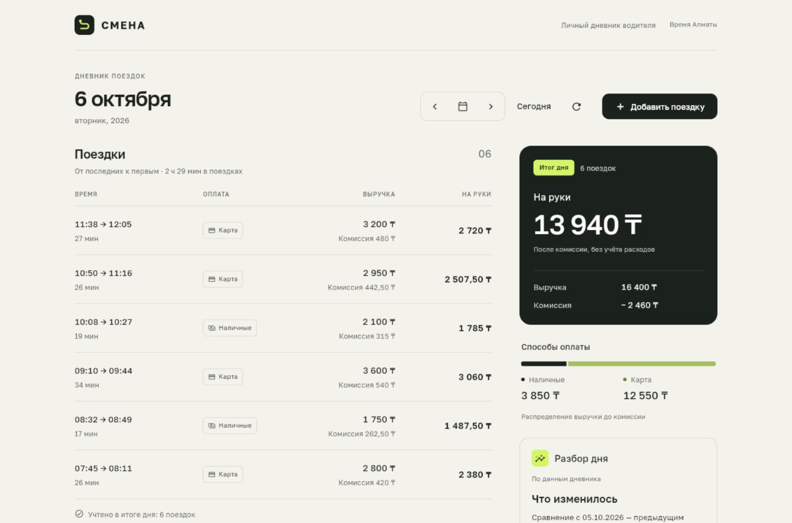
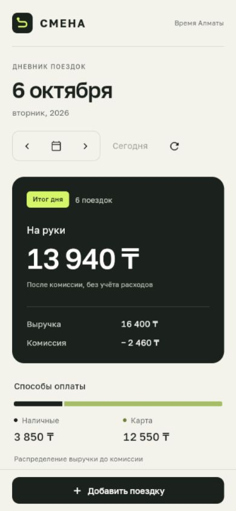
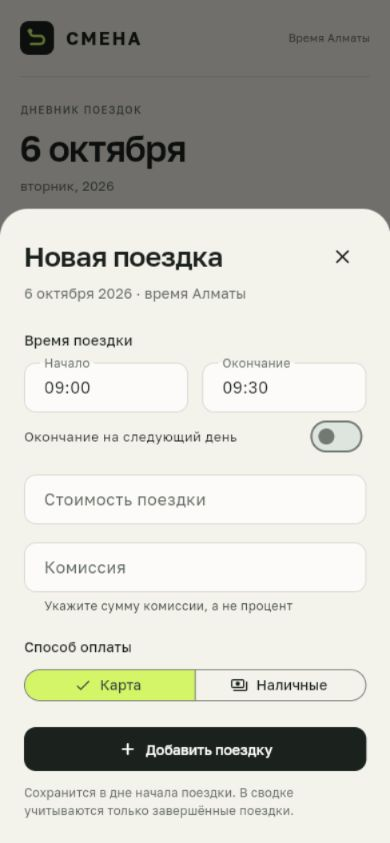
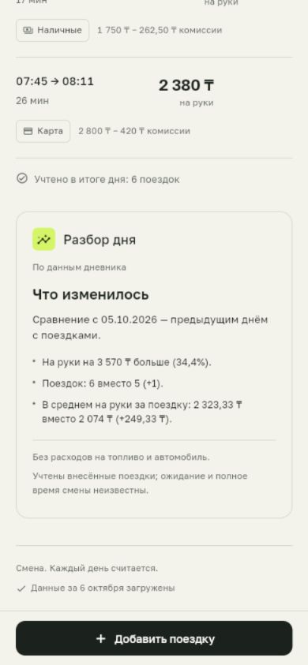

# Смена — дневник поездок водителя

[](https://github.com/topchik77/smena-arqa/actions/workflows/checks.yml)

Тестовое задание [arqa](https://jobs.arqa.cc/). **Flutter · FastAPI · SQLite**.

Выбор дня, список поездок, сводка и добавление поездки. Данные сохраняются на сервере; повтор отправки не создаёт дубль. Веб-клиент работает на компьютере и телефоне, также собирается Android APK.



<p>
  
  
  
</p>

## Что сделано

| Требование задания | Реализация |
|---|---|
| Поездки и сводка за выбранный день | `GET /api/v1/days/{date}`: количество, выручка, комиссия, на руки, наличные/карта |
| Клиент с переключением дней | Календарь, соседние дни, переход на сегодня |
| Добавление через API | `POST /api/v1/trips`; также есть форма в приложении |
| Проверка данных | Сумма > 0, окончание позже начала, комиссия от 0 до суммы |
| Повтор без дублей | Один ID на поездку; транзакция и уникальность в SQLite |
| Тесты сводки и повторов | Расчёты, повторные и конкурентные запросы, конфликт данных |

Дополнительно: восстановление незавершённой отправки после перезапуска клиента, защита от устаревших ответов при смене даты, отдельные состояния ошибки/пустого дня и сравнение с предыдущим заполненным днём.

**Контрольный пример — 1 октября 2026:** 2 поездки; выручка **3 900 ₸**, комиссия **585 ₸**, на руки **3 315 ₸**; наличные **1 500 ₸**, карта **2 400 ₸**. Официальный JSON сохранён в `data/trips.json`, дополнительные примеры — отдельно в `data/demo-trips.json`.

## Запуск

Нужны Python 3.12+ и Flutter в PATH. Проверено локально с Python 3.14 и Flutter 3.47.6. Для веб-версии Android SDK не требуется.

Из корня репозитория:

```powershell
# Windows
./scripts/start.ps1
```

```sh
# Linux / macOS
sh scripts/start.sh
```

Скрипт установит зависимости, соберёт веб-клиент, импортирует примеры и запустит приложение:

- **Приложение:** http://127.0.0.1:8000
- **Swagger / проверка API:** http://127.0.0.1:8000/docs

Первый запуск дольше из-за сборки Flutter. База хранится в `var/arqa.sqlite3`; перезапуск и повторный импорт не создают дубли. Внешние API и ключи для запуска не нужны.

Есть Docker Compose: `docker compose up --build`. Контейнерный запуск пока не проверен; проверка конфигурации пройдена. Ручной запуск, переменные окружения и Android по USB — в [инструкции](docs/RUNNING.md).

## Как проверить

1. Откройте **1 октября** и сравните суммы с контрольным примером выше.
2. В Swagger вызовите `POST /api/v1/trips` с телом ниже. Первая отправка вернёт **201**, повтор того же тела — **200**. В выбранном дне останется одна такая поездка.
3. Измените сумму при прежнем ID — получите **409**. Отрицательная сумма или окончание раньше начала дадут **422**.

```json
{
  "id": "check-trip-1",
  "start": "2026-10-08T08:10:00+05:00",
  "end": "2026-10-08T08:32:00+05:00",
  "amount": "2400.00",
  "payment": "card",
  "commission": "360.00"
}
```

Автоматические проверки после локального запуска:

```powershell
# Из backend/ (Linux/macOS: .venv/bin/python вместо .venv/Scripts/python.exe)
.venv/Scripts/python.exe -m pip install -r requirements-dev.txt
.venv/Scripts/python.exe -m ruff check .
.venv/Scripts/python.exe -m pytest
```

```sh
# Из client/
flutter analyze
flutter test
```

**86 тестов backend и 13 тестов Flutter проходят локально и на GitHub Actions.** Ruff и Flutter analyzer — без замечаний; Web и APK собраны в [облачном прогоне](https://github.com/topchik77/smena-arqa/actions/runs/37591338032). [GitHub Actions](https://github.com/topchik77/smena-arqa/actions) запускает проверки и сборку на push/PR; статус конкретного прогона виден там же. Actions не является хостингом API. Подробный [отчёт проверок](docs/VERIFICATION.md).

## Решения, влияющие на корректность

- День определяется началом поездки в `Asia/Almaty`. Поездка через полночь относится к дню начала.
- Деньги хранятся целыми тиынами; API возвращает десятичные строки. «На руки» = выручка − комиссия, без расходов на автомобиль.
- Один ID обозначает одну поездку. Эквивалентный повтор возвращает существующую запись, изменённые данные — конфликт. Разные ID считаются разными поездками.
- Перед отправкой клиент сохраняет ID и данные. После потери ответа повторяет ту же операцию, включая перезапуск приложения.
- Список и сводка читаются из одного снимка БД. Запоздалый ответ не подменяет выбранный день.

SQLite достаточно для однопользовательского задания. Авторизация, отмены и возвраты не входят в текущую модель завершённых поездок. [Архитектура](docs/ARCHITECTURE.md).

## Использование ИИ

Codex помог с дизайном, API, Flutter, тестами и ревью. Работа разделялась между агентами; результат проверялся сборками, тестами, запросами к API и через интерфейс.

Примеры исправлений после проверки: несогласованные ограничения суммы в форме и API; потеря ID незавершённой отправки при повторном отказе; возможность устаревшего ответа подменить выбранную дату. После обратной связи пользователя разбор, повторявший сводку, заменён сравнением дней. [Подробности процесса и ошибок](docs/AI-WORKFLOW.md).

Разбор дня по умолчанию работает по формулам. Необязательная модель может только выбрать готовые проверенные факты — она не считает деньги. Живые вызовы модели не проверялись; интеграция покрыта mock-тестами. [Настройка и ограничения](docs/AI.md).

