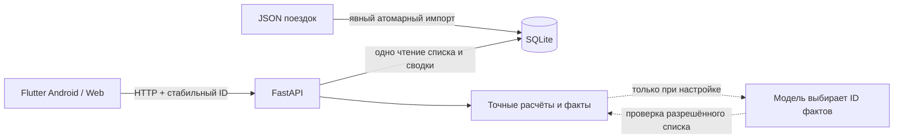

# Решения и границы

## Контекст

Нужен проверяемый мини-проект: дневник одного водителя, список и сводка дня, добавление через API, корректные повторы. Размер исходного набора мал; внешних API поездок и учётных записей в задании нет.

## Сервер и хранение

FastAPI даёт типизированный контракт и OpenAPI; SQLite избавляет проверяющего от настройки отдельной БД. Это один сервис, не набор микросервисов. Времена хранятся нормализованными в UTC, день — отдельно в IANA-зоне `Asia/Almaty`; индекс покрывает выборку по дню и времени.

`BEGIN IMMEDIATE` блокирует конкурирующих писателей до проверки ID. Одинаковый повтор возвращает старый результат; конфликт содержимого не изменяет запись. Уникальный первичный ключ остаётся последней защитой. WAL позволяет чтение во время записи. Сводка вычисляется из тех же строк, которые отправляются клиенту, без независимого второго запроса.

Импорт предварительно валидирует весь JSON и записывает его одной транзакцией. Ошибка или конфликт не оставляет частичного импорта. Хранилище переживает перезапуск процесса.

Модель не пытается угадать тождество поездок по сумме и времени: две реальные поездки могут иметь одинаковые поля. Одна операция должна сохранять свой ID. Клиент генерирует UUID и сохраняет payload до сетевого запроса. Сервер не требует знания о конкретной реализации клиента.

## Клиент

Flutter использует небольшие отдельные компоненты: сетевой репозиторий, контроллер выбранного дня, управление незавершённой отправкой и виджеты. Зависимости ограничены HTTP, локальным хранилищем, локализацией и часовыми поясами.

Номер загрузки защищает от запоздалых ответов при смене даты. Загрузка, пустой день и ошибка — отдельные состояния. Кнопка повторной отправки использует неизменные сохранённые данные, а не заново созданную поездку. Последняя неопределённая операция восстанавливается после закрытия приложения.

Веб и API обслуживаются одним origin. Режим разработки с разными портами имеет явный список разрешённых CORS origins. Android release допускает незашифрованный HTTP только для локальной демонстрации; удалённые адреса требуют HTTPS.

## Деньги и время

Сервер — источник итогов. Внутри приложения и БД деньги целые, в API ответы десятичными строками в тенге. Клиент также отправляет строки, чтобы исключить преобразования денежных значений через двоичную дробь. Пример задания с целыми JSON-числами поддерживается.

«На руки» означает только выручку минус переданную комиссию. Наличные и карта показывают способ оплаты, не доступные средства. Длительность поездок не называется длительностью смены. Для пересечения полуночи выбрано правило даты начала; это явно зафиксированное допущение.

## Необязательный ИИ

Внешний вызов не находится на пути загрузки дневника или сохранения поездки. Модель получает агрегаты и готовые факты, возвращает только разрешённые ID. Проверка ответа не позволяет ей изменить арифметику или добавить вымышленный совет. При отказе работает локальный разбор. Это дополнительная функция с ограниченной ценностью на двух поездках, а не основание усложнять основной продукт. Подробнее: [AI.md](AI.md).

## Что понадобится при росте

- Несколько водителей: авторизация и принадлежность каждой записи пользователю; ID/идемпотентность в границах пользователя.
- Несколько API-процессов с частыми записями: PostgreSQL и управляемые миграции; общие лимиты и кеш ИИ.
- Полноценная офлайн-работа: локальная база и очередь операций с явным разрешением конфликтов.
- Исправления/возвраты: отдельные события корректировки, причина и аудит; не молчаливое удаление финансовой записи.
- Публичный сервис: эксплуатационные метрики, резервное копирование с проверкой восстановления, ограничение запросов и тела, HTTPS и секреты через окружение/хранилище секретов.

Эти возможности не заявляются как реализованные в мини-проекте.
